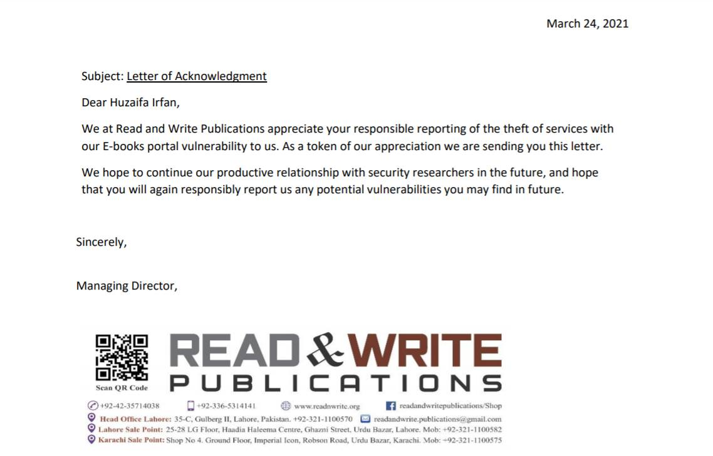

# RWEBooks Security Audit
**`RWEbooks Paid Ebooks Downloader`**

Developed on : 19 March 2021

## 🎬 Demo Video

## 🚀 Acknowledgment Letter

## 📝 Description

Ebook Website:
https://rwebooks.com/ 
by 
https://www.readnwrite.org/ 

where we can get paid O/A Level Preperation ebooks.

There is free fifteen Pages for preview.
The php based script behind which returns the preview pages. return white screen, when opened in new tab or seperatedly.
The Images can be fetched by the query string of book_id and page_number. which returns white image upon normal request.

So, I developed a software that simulates request headers "Same Origin" required by images endpoint as in the preview pages section to get all other pages of the book and download them in folder.

And Informed the developers about the bug.

# 🤝🏻 Connect with Me

# 📜 License

Licensed under the MIT License, Copyright 2025 Huzaifa Irfan. [LICENSE](LICENSE)
